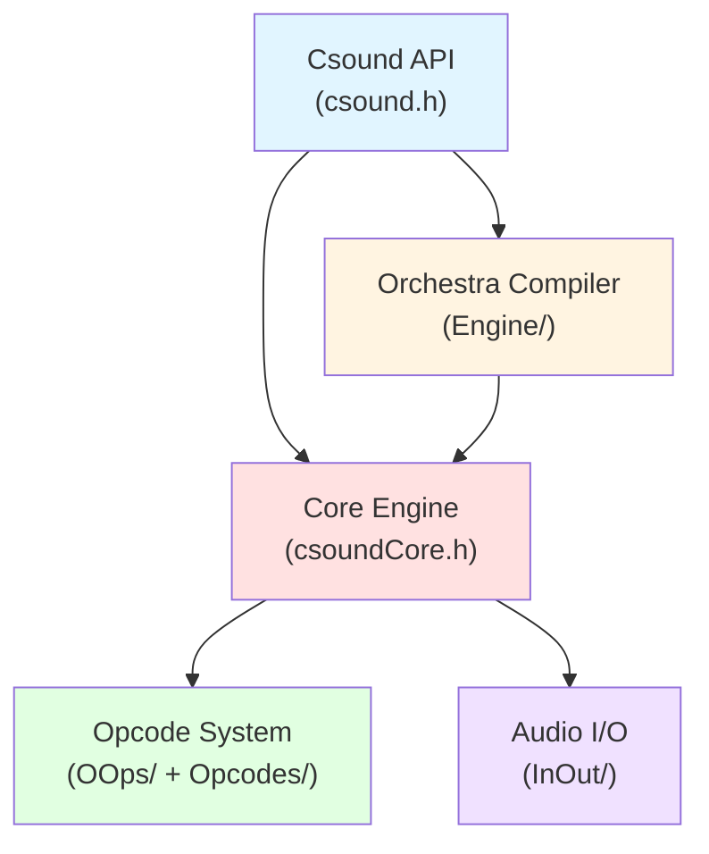

Csound is a sophisticated sound and music computing system with a modular architecture designed for flexibility, extensibility, and real-time performance. This document provides an overview of the system's architectural design.

## Overview

Csound's architecture follows a traditional compiler-interpreter model, separating the compilation of orchestra code from the performance (execution) phase. The system is built around several interconnected subsystems that work together to process audio in real-time.



## Core components

### Public API layer

The public API is defined in `include/csound.h` and provides the interface for host applications:

- **CSOUND structure**: Opaque handle to the Csound instance
- **Lifecycle management**: Create, compile, perform, destroy
- **Parameter control**: Set/get configuration options
- **Real-time interaction**: Score events, channels, callbacks

```c title="include/csound.h:155"
typedef struct CSOUND_  CSOUND;

// Status codes
typedef enum {
    CSOUND_SUCCESS = 0,
    CSOUND_ERROR = -1,
    CSOUND_INITIALIZATION = -2,
    CSOUND_PERFORMANCE = -3,
    CSOUND_MEMORY = -4,
    CSOUND_SIGNAL = -5
} CSOUND_STATUS;
```

### Engine layer

The `Engine/` directory contains the core compilation and orchestration logic:

<CardGroup cols={2}>
  <Card title="Compiler" icon="gears">
    - **Lexer/Parser**: `csound_orc.lex`, `csound_orc.y`
    - **Type system**: `csound_type_system.c`
    - **Semantic analysis**: `csound_orc_semantics.c`
    - **Code generation**: `csound_orc_compile.c`
    - **Optimization**: `csound_orc_optimize.c`
  </Card>

  <Card title="Runtime" icon="play">
    - **Performance control**: `musmon.c`
    - **Event scheduling**: `linevent.c`
    - **Opcode management**: `insert.c`, `entry.c`
    - **User-defined opcodes**: `udo.c`
    - **Parallel execution**: `cs_par_base.c`
  </Card>
</CardGroup>

Key functions from `Engine/README.md`:

- **auxfd.c**: Auxiliary resource management for opcodes
- **cfgvar.c**: Configuration variable functions
- **corfiles.c**: Core file processing for Csound programs and scores
- **fgens.c**: Function table generators
- **memalloc.c**: Memory resources management
- **symbtab.c**: Compiler symbol table

### Core data structures

The internal engine structures are defined in `include/csoundCore.h`:

#### Instrument definition (INSTRTXT)

```c title="include/csoundCore.h:133"
typedef struct instr {
    struct op *nxtop;          // Linked list of opcodes
    TEXT t;                    // Text of instrument
    int32_t pmax, vmax;        // Arg count, variable size
    CS_VAR_POOL *varPool;      // Variable pool
    int16 muted;               // Mute state
    struct insds *instance;    // Chain of active instances
    struct instr *nxtinstxt;   // Next instrument
    int32_t active;            // Active count
    char *insname;             // Instrument name
} INSTRTXT;
```

#### Instrument instance (INSDS)

```c title="include/csoundCore.h:427"
typedef struct insds {
    struct opds *nxti;         // Init-time opcodes
    struct opds *nxtp;         // Performance-time opcodes
    struct opds *nxtd;         // Deinit opcodes
    int16 insno;               // Instrument number
    INSTRTXT *instr;           // Instrument definition
    char actflg;               // Active flag
    double offtim;             // Turn-off time
    CSOUND *csound;            // Engine pointer
    uint32_t ksmps;            // Block size
    MYFLT esr;                 // Sample rate
} INSDS;
```

#### Opcode entry (OENTRY)

```c title="include/csoundCore.h:90"
typedef struct oentry {
    char *opname;              // Opcode name
    size_t dsblksiz;           // Data structure size
    int32_t flags;             // Behavior flags
    char *outypes;             // Output types (e.g., "a")
    char *intypes;             // Input types (e.g., "kk")
    SUBR init;                 // Init function
    SUBR perf;                 // Performance function
    SUBR deinit;               // Cleanup function
} OENTRY;
```

### Opcode system

Opcodes are implemented in two directories:

- **OOps/**: Internal (built-in) opcodes - core functionality
- **Opcodes/**: External (plugin) opcodes - extended functionality

From `OOps/README.md`:
- Audio I/O, signal generators, filters
- FFT routines, phase vocoder operations
- MIDI operations, control flow
- Scheduling, string manipulation

## Execution model

### Initialization phase

1. **Instance creation**: `csoundCreate()` allocates CSOUND structure
2. **Orchestra compilation**: `csoundCompileOrc()` parses and compiles instrument definitions
3. **Score compilation**: `csoundReadScore()` processes score events
4. **Audio setup**: `initialise_io()` configures audio backend
5. **Opcode initialization**: All i-rate opcodes execute

### Performance cycle

The main performance loop executes in k-rate cycles:

```c title="Engine/musmon.c:64"
MYFLT initialise_io(CSOUND *csound) {
    OPARMS *O = csound->oparms;
    // Configure buffer sizes
    O->inbufsamps = O->outbufsamps;
    // Open audio devices
    if (O->sfread) sf_open_in(csound);
    if (O->sfwrite) sf_open_out(csound);
    return csound->GetSystemSr(csound, 0);
}
```

Each k-period:

1. **Event sensing**: Check for new score events, MIDI, real-time events
2. **Instance activation**: Start new instrument instances
3. **Performance**: Execute k-rate and a-rate opcodes for all active instances
4. **Audio output**: Write audio buffer to output
5. **Deactivation**: Turn off completed instrument instances

<Note>
The `ksmps` parameter determines the number of audio samples per control period, balancing control rate precision against computational efficiency.
</Note>

## Parallel execution

Csound 6+ includes parallel execution capabilities in `cs_par_base.c`:

- **Dependency analysis**: Automatically detect opcode dependencies
- **Thread pools**: Distribute independent opcodes across CPU cores
- **Lock-free queues**: Manage parallel task dispatch
- **NUMA awareness**: Optimize memory access patterns

From `Engine/README.md`:
- **cs_new_dispatch.c**: Task dependency management and dispatching
- **cs_par_orc_semantic_analysis.c**: Parallel semantics analysis

## Memory management

Csound uses several memory management strategies:

### AUXCH system

```c title="include/csoundCore.h:194"
typedef struct auxch {
    struct auxch *nxtchp;
    size_t size;
    void *auxp, *endp;
} AUXCH;
```

Opcodes request auxiliary memory via `AUXCH` for:
- Delay line buffers
- FFT scratch space
- State variables
- Large working arrays

### Memory pools

- **String pool**: Deduplicated string storage
- **Variable pool**: Per-instrument variable allocation
- **Opcode pool**: Reusable opcode instance memory

<Tip>
From `Engine/README.md`, memory management is handled by `memalloc.c` and `auxfd.c` for auxiliary resource management.
</Tip>

## Type system

Csound 6+ introduced a sophisticated type system (`csound_type_system.c`):

- **Primitive types**: `i`, `k`, `a`, `S` (i-rate, k-rate, a-rate, string)
- **Array types**: Multi-dimensional arrays of any type
- **User-defined types**: Struct-like composite types
- **Polymorphic opcodes**: Overloading based on type signatures

Type information flows through:
1. Parser: Infer types from context
2. Semantic analysis: Check type compatibility
3. Code generation: Generate type-specific code
4. Runtime: Type metadata for dynamic operations

## Modularity and extensibility

Csound's architecture enables extension through:

### Plugin opcodes

Developers can add opcodes via dynamic libraries:

```c title="Engine/entry.c:78"
const OENTRY opcodlst_1[] = {
    { "oscil", /* ... */ },
    { "filter", /* ... */ },
    // ...
};
```

### User-defined opcodes (UDOs)

Users can define opcodes in Csound language itself:

```csound
opcode MyFilter, a, ak
    ain, kcf xin
    aout butterlp ain, kcf
    xout aout
endop
```

UDOs are compiled and optimized like built-in opcodes (see `Engine/udo.c`).

## Related topics

<CardGroup cols={2}>
  <Card title="Audio engine" href="/concepts/audio-engine" icon="waveform">
    Deep dive into audio processing and I/O
  </Card>
  <Card title="Opcode system" href="/concepts/opcodes" icon="cube">
    How opcodes work and how to create them
  </Card>
  <Card title="Instruments" href="/concepts/instruments" icon="music">
    Orchestra and instrument concepts
  </Card>
  <Card title="API reference" href="/api/c/overview" icon="book">
    Complete API documentation
  </Card>
</CardGroup>
