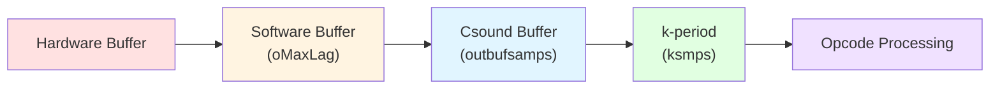

Csound's audio engine is responsible for generating and processing audio samples in real-time or offline. It manages the flow of audio data through instrument instances, handles I/O buffering, and ensures sample-accurate timing.

## Audio processing fundamentals

### Sample rates and control rates

Csound operates at two fundamental rates:

- **Sample rate (sr)**: Frequency at which audio samples are generated (e.g., 44100 Hz)
- **Control rate (kr)**: Frequency at which control signals are updated

The relationship is defined by `ksmps` (k-rate samples):

```
kr = sr / ksmps
```

<Tip>
Typical values: `sr = 48000`, `ksmps = 64` yields `kr = 750 Hz`. Smaller `ksmps` provides more responsive control but increases CPU overhead.
</Tip>

### Audio vectors

Audio signals (a-rate) are processed in blocks called vectors:

```c title="include/csoundCore.h:475"
typedef struct insds {
    // ...
    uint32_t ksmps;              // Instrument copy of ksmps
    MYFLT esr;                   // Local sample rate
    MYFLT ekr;                   // Local control rate
    MYFLT onedsr;                // 1/sr for efficiency
    MYFLT onedksmps, onedkr;     // More reciprocals
    uint32_t ksmps_offset;       // Sample-accurate offset
    uint32_t ksmps_no_end;       // Samples left at end
} INSDS;
```

Each k-period, opcodes process `ksmps` samples in a tight loop for efficiency.

## Audio I/O architecture

The audio I/O system is initialized by `initialise_io()` from `Engine/musmon.c`:

```c title="Engine/musmon.c:64"
MYFLT initialise_io(CSOUND *csound) {
    OPARMS *O = csound->oparms;
    
    // Configure buffer sizes
    if (csound->enableHostImplementedAudioIO) {
        int32_t bufsize = csound->hostRequestedBufferSize;
        int32_t ksmps = csound->ksmps;
        bufsize = (bufsize + (ksmps >> 1)) / ksmps;
        bufsize = (bufsize ? bufsize * ksmps : ksmps);
        O->outbufsamps = O->inbufsamps = bufsize;
    } else {
        if (!O->oMaxLag) O->oMaxLag = IODACSAMPS;
        if (!O->outbufsamps) O->outbufsamps = IOBUFSAMPS;
    }
    
    // Adjust for channel count
    O->inbufsamps *= csound->inchnls;
    O->outbufsamps *= csound->nchnls;
    
    // Open audio devices
    if (O->sfread) sf_open_in(csound);
    if (O->sfwrite && !csound->initonly)
        sf_open_out(csound);
        
    csound->io_initialised = 1;
    return csound->GetSystemSr(csound, 0);
}
```

### Buffer management

Csound uses a triple-buffer strategy:

1. **Software buffers**: Large buffers for OS audio API (`oMaxLag`)
2. **Csound buffers**: Working buffers (`inbufsamps`, `outbufsamps`)
3. **k-period buffers**: Small buffers for processing (`ksmps` samples)



<Note>
From `Engine/musmon.c:102`, buffer sizes are logged: "audio buffered in N sample-frame blocks"
</Note>

## Signal flow

### Input to output path

Audio flows through Csound in this sequence:

<Steps>
  <Step title="Audio input">
    Physical audio interface → driver → `spin` buffer
  </Step>
  
  <Step title="Instrument processing">
    Each active instrument reads from `spin` and writes to `spout`
  </Step>
  
  <Step title="Mixing">
    All instrument outputs accumulate in the global `spout` buffer
  </Step>
  
  <Step title="Audio output">
    `spout` → driver → physical audio interface
  </Step>
</Steps>

```c title="include/csoundCore.h:493"
typedef struct insds {
    // ...
    MYFLT *spin;    // Offset into csound->spin (input)
    MYFLT *spout;   // Offset into csound->spout (output)
} INSDS;
```

### Multi-channel handling

Csound natively supports multi-channel audio:

```c title="include/csoundCore.h:143"
static uint32_t csoundGetNchnls(CSOUND *csound) {
    return csound->nchnls;
}

static uint32_t csoundGetNchnlsInput(CSOUND *csound) {
    return (csound->inchnls >= 0) ? csound->inchnls : 0;
}
```

- **Interleaved format**: Channels stored as `[L0, R0, L1, R1, ...]`
- **Channel routing**: Opcodes specify which channels to read/write
- **Upmixing/downmixing**: Automatic when channel counts differ

## Performance cycle

### The k-rate loop

The main audio generation happens in the performance loop:

```
for each k-period:
    1. Read input buffer (if any)
    2. For each active instrument instance:
        a. Execute k-rate opcodes (once per k-period)
        b. Execute a-rate opcodes (ksmps times)
    3. Mix outputs to master buffer
    4. Write output buffer
    5. Advance time counters
```

This is implemented in `kperf()` (Top/csound.c:73).

### Opcode execution order

Within each instrument instance:

1. **Init phase** (`nxti` chain): Runs once when instance starts
2. **Performance phase** (`nxtp` chain): Runs every k-period
3. **Deinit phase** (`nxtd` chain): Runs once when instance ends

```c title="include/csoundCore.h:427"
typedef struct insds {
    struct opds *nxti;    // Init-time opcodes
    struct opds *nxtp;    // Performance-time opcodes  
    struct opds *nxtd;    // Deinit opcodes
    // ...
} INSDS;
```

Opcodes are linked in a chain for efficient traversal.

## Sample-accurate timing

Csound 6+ provides sample-accurate timing for note starts and parameter changes:

### Offset mechanism

```c title="include/csoundCore.h:488"
typedef struct insds {
    uint32_t ksmps_offset;    // Start offset for sample accuracy
    uint32_t ksmps_no_end;    // Samples to skip at end
} INSDS;
```

Opcodes that support sample accuracy:

```c
MYFLT *out = p->sr;
uint32_t offset = p->h.insdshead->ksmps_offset;
uint32_t early = p->h.insdshead->ksmps_no_end;
uint32_t nsmps = CS_KSMPS;

// Skip initial samples
if (offset) memset(out, 0, offset * sizeof(MYFLT));
if (early) {
    nsmps -= early;
    memset(&out[nsmps], 0, early * sizeof(MYFLT));
}

// Process samples from offset to nsmps
for (n = offset; n < nsmps; n++) {
    out[n] = process_sample();
}
```

Example from `Opcodes/butter.c:60`.

## Signal generators

Csound includes various signal generation opcodes in `OOps/`:

### Oscillators

From `OOps/ugens2.c`, phase accumulation for oscillators:

```c title="OOps/ugens2.c:42"
int32_t phsset(CSOUND *csound, PHSOR *p) {
    MYFLT phs;
    int32_t longphs;
    if ((phs = *p->iphs) >= FL(0.0)) {
        if ((longphs = (int32_t)phs)) {
            csound->Warning(csound, Str("init phase truncation\n"));
        }
        p->curphs = phs - (MYFLT)longphs;
    }
    return OK;
}
```

<CardGroup cols={2}>
  <Card title="ugens2.c" icon="wave-square">
    Standard periodic signal generators, table lookup oscillators
  </Card>
  <Card title="ugens3.c" icon="signal">
    FM synthesis, sample playback, additive synthesis
  </Card>
  <Card title="ugens4.c" icon="wind">
    Broadband periodic and noise generators
  </Card>
  <Card title="oscils.c" icon="chart-line">
    Specialist periodic signal generators, advanced table lookup
  </Card>
</CardGroup>

### Filters

From `OOps/README.md`, `ugens5.c` provides standard filters and LPC.

Example Butterworth filter from `Opcodes/butter.c`:

```c title="Opcodes/butter.c:48"
int32_t butset(CSOUND *csound, BFIL *p) {
    IGN(csound);
    if (*p->istor == FL(0.0)) {
        p->a[6] = p->a[7] = 0.0;
        p->lkf = FL(0.0);
    }
    return OK;
}
```

Filters typically maintain state in their data structures for continuous processing.

## FFT and frequency domain

Csound provides extensive FFT capabilities:

### FFT libraries

- **fftlib.c**: Radix-2 FFT routines (OOps/)
- **mxfft.c**: Non-radix-2 FFT routines (OOps/)
- **pffft.c**: Alternative radix-2 implementation (OOps/)

From `OOps/README.md`:
- **pvsanal.c**: Phase vocoder analysis and synthesis
- **pstream.c**: Streaming phase vocoder opcodes
- **pvfileio.c**: Phase vocoder file I/O

### Phase vocoder data

Frequency domain data uses the `PVSDAT` structure:

```c title="include/csound.h:158"
typedef struct pvsdat PVSDAT;
```

This represents spectral data in amplitude-frequency or amplitude-phase format.

## Real-time optimization

### Vectorization

Many opcodes use SIMD instructions for parallel processing:

- Manual loop unrolling
- Compiler auto-vectorization hints
- Platform-specific intrinsics (SSE, AVX, NEON)

### Cache efficiency

Memory access patterns optimized for:

- Sequential buffer traversal
- Small working sets
- Aligned allocations
- Prefetching hints

### Lock-free algorithms

Real-time audio threads avoid locks using:

- Atomic operations
- Ring buffers
- Wait-free message passing

From `Engine/README.md`, parallel execution is managed in `cs_par_base.c` and `cs_new_dispatch.c`.

## Audio backends

Csound supports multiple audio backends:

- **PortAudio**: Cross-platform (default)
- **JACK**: Low-latency Linux/macOS
- **ALSA**: Linux native
- **CoreAudio**: macOS native
- **WASAPI**: Windows native
- **PulseAudio**: Linux desktop

Backend selection and configuration happens in `InOut/` directory.

## Sample rate conversion

From `Engine/README.md`, `srconvert.c` handles sampling rate conversion when:

- Hardware SR differs from Csound SR
- Reading audio files at different rates
- Resampling for effects

Conversion modes in `INSDS`:

```c title="include/csoundCore.h:477"
int32_t in_cvt, out_cvt;  // Resampling converter modes
```

## Auxiliary memory management

Opcodes use `AUXCH` for dynamic buffers:

```c title="include/csoundCore.h:194"
typedef struct auxch {
    struct auxch *nxtchp;
    size_t size;
    void *auxp, *endp;
} AUXCH;
```

From `Engine/README.md`, auxiliary resource management is in `auxfd.c`.

Opcodes request memory:

```c
csound->AuxAlloc(csound, size, &p->auxch);
```

Memory persists across k-periods and is automatically freed on instance cleanup.

## Performance monitoring

Csound tracks performance metrics:

```c title="include/csoundCore.h:152"
typedef struct instr {
    // ...
    MYFLT cpuload;    // % load this instrument makes
} INSTRTXT;
```

Benchmarking output from `Engine/musmon.c:126`:

```c
void print_benchmark_info(CSOUND *csound, const char *s) {
    double rt, ct;
    if ((csound->oparms->msglevel & CS_TIMEMSG) == 0) return;
    rt = csoundGetRealTime(csound->csRtClock);
    ct = csoundGetCPUTime(csound->csRtClock);
    csound->ErrorMsg(csound,
        Str("Elapsed time at %s: real: %.3fs, CPU: %.3fs\n"),
        s, rt, ct);
}
```

## Related topics

<CardGroup cols={2}>
  <Card title="Architecture" href="/concepts/architecture" icon="sitemap">
    Overall system architecture
  </Card>
  <Card title="Opcodes" href="/concepts/opcodes" icon="cube">
    How opcodes process audio
  </Card>
  <Card title="Instruments" href="/concepts/instruments" icon="music">
    Instrument instances and lifecycle
  </Card>
  <Card title="Performance" href="/development" icon="gauge-high">
    Optimization and profiling
  </Card>
</CardGroup>
