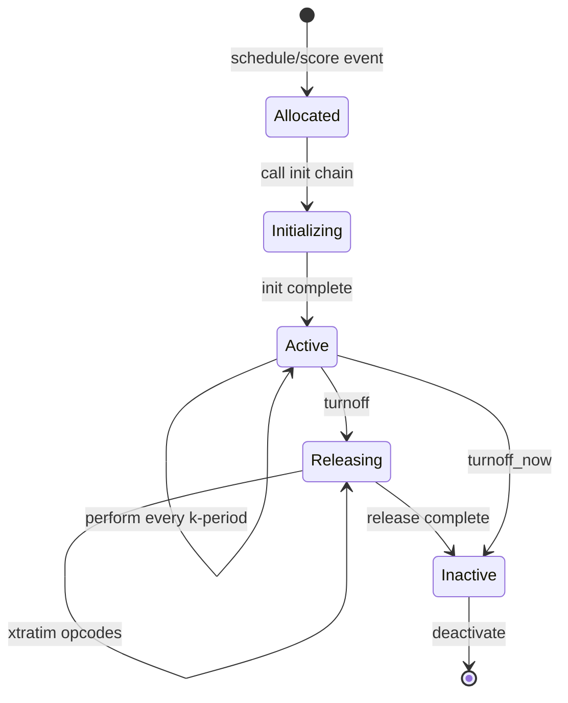

In Csound, instruments are templates that define how sound is generated or processed. The orchestra is the collection of all instrument definitions. This document explains how instruments work internally.

## Instrument fundamentals

An instrument is:

- A **definition** (`INSTRTXT`): Template containing opcode chains
- **Instances** (`INSDS`): Active copies running in performance
- A **number or name**: Identifier for score events to trigger

```csound
instr 1
    iamp = p4
    ifreq = p5
    
    aout oscil iamp, ifreq, 1
    out aout
endin

instr Reverb
    ain inch 1
    aout reverb ain, 2.5
    outch 1, aout
endin
```

## Instrument definition structure

Instrument definitions are stored in `INSTRTXT` structures:

```c title="include/csoundCore.h:133"
typedef struct instr {
    struct op *nxtop;           // Linked list of opcodes
    TEXT t;                     // Text of instrument
    int32_t pmax, vmax;         // Max p-fields, variable size
    int32_t pextrab;            // Extra p-field bytes
    CS_VAR_POOL *varPool;       // Variable pool
    int16 muted;                // Mute state
    int32 opdstot;              // Total opcode data size
    MYFLT *psetdata;            // Data for pset opcode
    
    struct insds *instance;     // Chain of active instances
    struct insds *lst_instance; // Last allocated instance
    struct insds *act_instance; // Chain of free instances
    
    struct instr *nxtinstxt;    // Next instrument
    int32_t active;             // Count of active instances
    int32_t pending_release;    // Count in release phase
    int32_t maxalloc;           // Max simultaneous instances
    int32_t turnoff_mode;       // Behavior when maxalloc exceeded
    MYFLT cpuload;              // CPU percentage used
    
    struct opcodinfo *opcode_info; // UDO info (if this is a UDO)
    char *insname;              // Instrument name (if named)
    int32_t instcnt;            // Total instances ever created
    int32_t isNew;              // Is this a new definition
    int32_t nocheckpcnt;        // Control p-field checks
} INSTRTXT;
```

### Named instruments

From `Engine/README.md`, named instruments are handled by `namedins.c`:

```c title="include/csoundCore.h:163"
typedef struct namedInstr {
    int32 instno;               // Internal instrument number
    char *name;                 // String name
    INSTRTXT *ip;               // Pointer to definition
    struct namedInstr *next;    // Next in list
} INSTRNAME;
```

Instruments can be referenced by name or number:

```csound
schedule "Reverb", 0, 10  ; by name
schedule 5, 0, 10          ; by number
```

## Instrument compilation

When orchestra code is compiled:

<Steps>
  <Step title="Parsing">
    Orchestra parser (`Engine/csound_orc.y`) reads instrument definition
  </Step>
  
  <Step title="Semantic analysis">
    Type checking and validation (`Engine/csound_orc_semantics.c`)
  </Step>
  
  <Step title="Opcode instantiation">
    Build opcode chains (`Engine/insert.c`)
  </Step>
  
  <Step title="Optimization">
    Optimize expressions (`Engine/csound_orc_optimize.c`)
  </Step>
  
  <Step title="Registration">
    Add to instrument table for event scheduling
  </Step>
</Steps>

From `Engine/csound_orc_compile.c:41`:

```c
static void instr_prep(CSOUND *, INSTRTXT *, ENGINE_STATE *engineState);
static void build_const_pool(CSOUND *, INSTRTXT *, char *, int32_t inarg,
                             ENGINE_STATE *engineState);
static void close_instrument(CSOUND *csound, ENGINE_STATE *engineState, 
                            INSTRTXT *ip);
```

## Opcode chains

An instrument's opcodes are organized into chains:

```c title="include/csoundCore.h:174"
typedef struct op {
    struct op *nxtop;           // Next opcode in chain
    TEXT t;                     // Opcode text structure
} OPTXT;
```

<Accordion title="Opcode chain traversal">
Opcodes in an instrument are linked in definition order. At performance time, Csound walks these chains:

1. **Init chain** (`nxti`): Runs once at instrument start
2. **Performance chain** (`nxtp`): Runs every k-period
3. **Deinit chain** (`nxtd`): Runs once at instrument end

From `include/csoundCore.h:427`, the `INSDS` structure maintains these chains.
</Accordion>

## Instrument instances

When an instrument is triggered by a score event, an instance is created:

```c title="include/csoundCore.h:427"
typedef struct insds {
    // Opcode chains for this instance
    struct opds *nxti;          // Init-time opcodes
    struct opds *nxtp;          // Performance-time opcodes
    struct opds *nxtd;          // Deinit opcodes
    
    // Instance management
    struct insds *nxtinstance;  // Next allocated instance
    struct insds *prvinstance;  // Previous allocated instance
    struct insds *nxtact;       // Next active instance
    struct insds *prvact;       // Previous active instance
    struct insds *nxtoff;       // Next to terminate
    
    // Resources
    FDCH *fdchp;                // File handles
    AUXCH *auxchp;              // Auxiliary memory
    int32_t xtratim;            // Extra release time
    
    // MIDI
    MCHNBLK *m_chnbp;           // MIDI channel block
    struct insds *nxtolap;      // Next overlapping voice
    
    // Identity
    int16 insno;                // Instrument number
    INSTRTXT *instr;            // Instrument definition
    
    // State
    int16 m_sust;               // MIDI sustain flag
    unsigned char m_pitch;      // MIDI pitch
    unsigned char m_veloc;      // MIDI velocity
    char relesing;              // In release phase
    char actflg;                // Active flag
    
    // Timing
    double offbet;              // Turn-off beat
    double offtim;              // Turn-off time (seconds)
    
    // Audio parameters (per-instance)
    CSOUND *csound;             // Engine pointer
    uint64_t kcounter;          // k-period counter
    MYFLT esr, sicvt, pidsr;    // Sample rate
    MYFLT onedsr;               // 1/sr
    int32_t in_cvt, out_cvt;    // Sample rate converters
    uint32_t ksmps;             // Block size
    MYFLT ekr;                  // Control rate
    MYFLT onedksmps, onedkr, kicvt;
    
    // Control
    struct opds *pds;           // For control flow (goto, etc.)
    MYFLT scratchpad[4];        // Persistent scratch space
    
    // UDO support
    void *opcod_iobufs;         // I/O buffers for UDOs
    void *opcod_deact;          // UDO deactivation
    void *subins_deact;         // Subinstr deactivation
    
    // Sample accuracy
    uint32_t ksmps_offset;      // Start offset
    uint32_t no_end;            // Samples left at end
    uint32_t ksmps_no_end;      // Used by opcodes
    
    // Audio I/O
    MYFLT *spin;                // Input buffer
    MYFLT *spout;               // Output buffer
    
    // Initialization
    int32_t init_done;          // Init complete
    int32_t tieflag;            // Tied note
    int32_t reinitflag;         // Reinit in progress
    MYFLT retval;               // Return value
    MYFLT *lclbas;              // Variable memory base
    char *strarg;               // String argument
} INSDS;
```

### Instance lifecycle



<Steps>
  <Step title="Allocation">
    Memory allocated for instance data (`INSDS` + variable space + opcode data)
  </Step>
  
  <Step title="Initialization">
    Init chain executed once. P-fields copied, i-rate variables computed
  </Step>
  
  <Step title="Performance">
    Performance chain executed every k-period until turnoff time
  </Step>
  
  <Step title="Release">
    Optional extended release period via `xtratim` opcode
  </Step>
  
  <Step title="Cleanup">
    Deinit chain executed. Resources freed. Instance returned to pool
  </Step>
</Steps>

## Instance management

### Allocation and pooling

From `Engine/insert.c:26`, instance creation is managed by:

```c
static int32_t insert(CSOUND *csound, int32_t insno, EVTBLK *newevtp);
```

Csound maintains:
- **Active instances**: Currently performing (`actflg = 1`)
- **Free instances**: Allocated but inactive (instance pool)
- **Pending termination**: Scheduled to turn off

Instance recycling reduces allocation overhead.

### Max allocation

```c title="include/csoundCore.h:150"
int32_t maxalloc;           // Max simultaneous instances
int32_t turnoff_mode;       // Behavior when limit hit
```

When `maxalloc` is exceeded:

```c title="Engine/insert.c:46"
static void maxalloc_turnoff(CSOUND *csound, int32_t insno);
```

Options:
- Turn off oldest instance
- Turn off quietest instance  
- Reject new instance

## P-fields

P-fields are parameters passed to instruments from score events:

```csound
; p1=instr  p2=start  p3=dur  p4=amp  p5=freq
i 1        0         2       0.5     440
```

From `include/csoundCore.h:398`:

```c
typedef struct event {
    char opcod;                 // Event type ('i', 'f', 'e', etc.)
    int32_t pcnt;               // Number of p-fields
    MYFLT p2orig;               // Start time
    MYFLT p3orig;               // Duration
    MYFLT *p;                   // Array of p-fields
    int32_t scnt;               // String arg count
    char *strarg;               // String arguments
    void *pinstance;            // Instance pointer
    int32_t suppress_tie;       // Tie handling
} EVTBLK;
```

### P-field access

Inside instruments:

```csound
iamp = p4                    ; Direct access
kfreq = p(5)                 ; Runtime access
icount = p5 * p6 + p7        ; Expressions
```

P-field data copied to instance memory during initialization.

## Variable memory

### Variable pool

```c title="include/csoundCore.h:138"
CS_VAR_POOL *varPool;        // Per-instrument variable pool
```

Each instrument has a pool of variables:
- **i-rate**: Computed once at init
- **k-rate**: Updated every k-period
- **a-rate**: Vectors of `ksmps` samples
- **String**: Dynamic string storage
- **Arrays**: Multi-dimensional arrays

From `Engine/README.md`, symbol table management is in `symbtab.c`.

### Local memory base

```c title="include/csoundCore.h:500"
MYFLT *lclbas;               // Base for variable memory pool
```

Variables accessed via offsets from this base address.

## MIDI instrument integration

Instruments can respond to MIDI:

```c title="include/csoundCore.h:350"
typedef struct mchnblk {
    int16 pgmno;                // Program change
    int16 insno;                // Instrument number
    int16 channel;              // MIDI channel
    struct insds *kinsptr[128]; // Active notes by key
    MYFLT polyaft[128];         // Polyphonic aftertouch
    MYFLT ctl_val[136];         // Controller values
    MYFLT aftouch;              // Channel pressure
    MYFLT pchbend;              // Pitch bend
    // ...
} MCHNBLK;
```

From `Engine/insert.c:43`:

```c
static int32_t insert_midi(CSOUND *csound, int32_t insno, 
                          MCHNBLK *chn, MEVENT *mep);
```

MIDI events automatically create instrument instances with:
- P4 = velocity
- P5 = pitch (MIDI note number)
- Duration tied to note-on/note-off

<Tip>
From `OOps/README.md`, MIDI operations are in `midiops.c`, `midiops2.c`, `midiops3.c`, and `midiout.c`.
</Tip>

## Subinstruments

Instruments can trigger other instruments:

```csound
instr Master
    ; Schedule subinstrument
    schedule "Effect", 0, 1, 0.5, 1000
endin
```

From `OOps/README.md`, scheduling opcodes are in `schedule.c`.

Subinstrument features:
- Nested instrument hierarchy
- Parameter passing via p-fields
- Shared or isolated audio buses
- Parent-child lifetime management

## User-defined opcodes as instruments

UDOs are implemented internally as instruments:

```c title="include/csoundCore.h:153"
struct opcodinfo *opcode_info; // UDO info (when instrs are UDOs)
```

From `Engine/udo.c:1`:

```c
// user-defined opcodes and subinstruments
```

When a UDO is called:
1. A special instrument instance is created
2. Input args passed as p-fields or variables
3. Instrument body executes
4. Output args returned to caller
5. Instance cleaned up

<Accordion title="UDO performance check">
From `Engine/csound_orc_compile.c:62`:

```c
static int32_t udo_has_perf_opcodes(INSTRTXT *ip) {
    OPTXT *optxt = (OPTXT *) ip;
    while ((optxt = optxt->nxtop) != NULL) {
        TEXT *ttp = &optxt->t;
        if (ttp->oentry == NULL) continue;
        if (strcmp(ttp->oentry->opname, "$label") == 0) continue;
        if (strcmp(ttp->oentry->opname, "endop") == 0) break;
        if (ttp->oentry->perf != NULL) {
            return 1;
        }
    }
    return 0;
}
```

This determines if a UDO needs to run at performance time or just init time.
</Accordion>

## Performance monitoring

Per-instrument CPU usage tracking:

```c title="include/csoundCore.h:152"
MYFLT cpuload;               // % load this instrument makes
```

From `Engine/README.md`, performance control is in `musmon.c`.

Metrics available:
- Active instance count
- CPU percentage
- Max allocation reached
- Instances in release phase

## Debugging support

Debug information compilation:

```c title="include/csound.h:109"
typedef enum {
    DEBUG_NONE = 0,
    DEBUG_RUNTIME = 0x01,
    DEBUG_COMPILER = 0x02,
    DEBUG_SEMANTICS = 0x04,
    DEBUG_EXPRESSIONS = 0x08,
    DEBUG_PARSER = 0x10,
    DEBUG_TREE = 0x20,
    DEBUG_INSTR = 0x40,        // Print compiled instrs
    DEBUG_OPCODES = 0x80,
    DEBUG_PARCS = 0x100,
    DEBUG_FULL = 0x7FFFFFFF
} DEBUG_STATUS;
```

Debugging features:
- Line number tracking
- Instrument name/number in errors
- Instance pointer for crash analysis
- Opcode chain inspection

## Optimization

### Instance pooling

Reusing allocated instances avoids malloc/free overhead:

```c title="include/csoundCore.h:145"
struct insds *act_instance;  // Chain of free instances
```

### Constant folding

From `Engine/csound_orc_optimize.c`, compile-time expression evaluation:

```csound
ifreq = 440 * 2  ; Compiled to ifreq = 880
```

### Parallel execution

From `Engine/README.md`, parallel execution in `cs_par_base.c`:

- Multiple instances run on different cores
- Independent opcodes within instance parallelized
- SIMD vectorization of audio loops

## Related topics

<CardGroup cols={2}>
  <Card title="Architecture" href="/concepts/architecture" icon="sitemap">
    System architecture overview
  </Card>
  <Card title="Opcodes" href="/concepts/opcodes" icon="cube">
    How opcodes work in instruments
  </Card>
  <Card title="Audio engine" href="/concepts/audio-engine" icon="waveform">
    Audio processing details
  </Card>
  <Card title="Score" href="/essentials" icon="file-lines">
    Score events and scheduling
  </Card>
</CardGroup>
